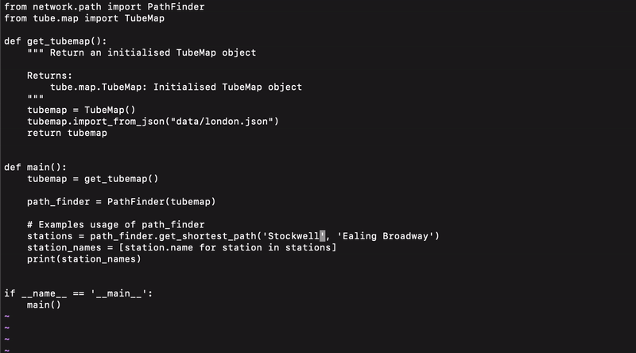

# Tube Map Python Coursework

## Context

This is a coursework assignment that I completed as part of my Python module in my MSc Artificial Intelligence. The details of the coursework are described in <em>description.pdf</em>. My contribution consisted in completing some of the classes in the existing project structure described below in order to create a program that find the shortest path between two tube stations from the London tube.

## Usage

To execute the code run `python3 main.py`. This will find the shortest path between 'Stockwell' and 'Ealing Broadway'.
To change the two stations: 

- open `main.py` 
- replace the tube stations in the line `stations = path_finder.get_shortest_path('Stockwell', 'Ealing Broadway')`
- execute `python3 main.py`

<p align="center">

<p/>

## Project Structure

```
Project folder/
├─ data/
│  ├─ london.json
├─ network/
│  ├─ path.py
│  ├─ graph.py
├─ tube/
│  ├─ components.py
│  ├─ map.py
├─ main.py
```

### `data/`

Contains the JSON file `london.json` describing the London Tube map.

### `network/`

- `path.py` contains the `PathFinder` class, used to compute the shortest path between two stations.


- `graph.py` contains the `NeighbourGraphBuilder` class, used to generate the abstract graph representing the Tube Map.
You can test its implementation via the command:
```bash
python -m network.graph
```

### `tube/`

- `components.py` contains the definitions of the following classes (_these classes are already implemented_):
  - `Station`
  - `Line`
  - `Connection`

- `map.py` contains the definition `TubeMap` class, used to read the data from a JSON file (for instance: `data/london.json`).
You can test its implementation via the command:
```bash
python -m tube.map
```

### `main.py`

Contains a test of the full pipeline:
1. Reading the JSON file using the class `TubeMap`.
2. Computing the shortest path between two stations using `PathFinder` and printing it.
